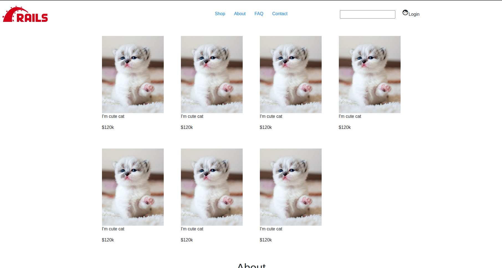

# README
Gem

# FUNCTIONS:
List function:
Store Page:
  * Home Index:
    * Show list product
    *
  * Show list product item (price, images (have many image), name, code_product, color, price, ), pagination
    * top save label on item
    * View detail show product info, return & refunction description, shipping info, product description
  * About block, can edit in cms write about webpage
  * Cart (product items, price, name, thumnail, quantity)
    * Cart page (voucher, add note, summary price, shipping, choose country, )
  * Search product
  * Login
  * Cms write about the page
  * Link to facbook intergram
  * Chat popup
  * FAQ page
  * Contact page

  * Subscrible email
  * Voucher code
  * Show best seller (show label best seller for top 10 product)
  * Have unittest
- Admin page:
  * can see contact information
  * manage color system:
    color_hash
  * manage product
    (name, price, currency, code_name, color, quantity, images, product description, return policy,shipping info, description detail)

# Home page:

# Schema:

# Task:

## FrontEnd
Stage 1:
- Home page > Handle navigation in header, CSS active tag on navigation
- Home page > Update UI search bar, login icon, cart icon
- Home page > Handle search bar
- Home page > Update UI body, handle hover product image, zooming it
- Home page > Update UI footer, about us
- Home page > Add link to footer make it work
- Home page > Update UI subscribe now input
- Home page > Add icon add to cart, show model popup add to cart show detail product
    - Product detail Model > Add UI, Handle add product to cart
- Login page > Update UI login page, register page
- Home page > fHandle subscribe
- Home page > add responsive on mobile

- Admin > Add backend layout   --> doing
- Admin > CRUD product (default size, color, manufacturer is hardcoded) --> doing
- Admin > Manage Order
- Admin > Manage Order Add chart
- Admin > Manage Inventory
- Admin > Mail marketing

Stage 2:
- Cart fixed on left side > add UI  > handle view cart
- Add cart page 
- handle click item in cart to navigate to product detail

Stage 3
- Login Page > 
- Facebook and Youtube link > Left side
- Blogs > Add blog tag
- Add CMS to update blog content
- Add CMS update content [about info, link fb, youtube]

## Config:
- Configure webpack             --> done
- Gem devise, cancancan, rolify --> doing
- Handle upload product    

# Reference
- [template shopify by www.wix.com](https://www.wix.com/website-template/view/html/2175?siteId=f079a559-b478-4643-a17b-13edb1ee067b&metaSiteId=f9bf8eee-6569-46fa-b4e8-e6b8ca8990c1&originUrl=https%3A%2F%2Fwww.wix.com%2Fwebsite%2Ftemplates%2Fhtml%2Fonline-store&tpClick=view_button)
- [template admin page](https://github.com/flatlogic/react-material-admin)
